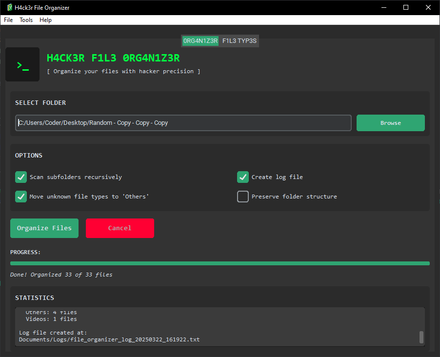

# H4ck3r File Organizer

A modern, hacker-themed file organization utility with a matrix-inspired interface designed to efficiently organize files by type.

## Features

- **Matrix-Inspired UI**: Stylish dark green-on-black hacker aesthetic
- **Smart File Organization**: Automatically sorts files into appropriate folders based on extension types
- **Extensive File Support**: Organizes various file types including videos, audio, documents, images, Adobe files, and more
- **Customizable Options**:
  - Recursive folder scanning
  - Log file generation
  - Handling of unknown file types
  - Preservation of folder structure
- **Real-time Statistics**: Track progress and view organization results
- **User-Friendly Interface**: Modern tabs and clean design with customtkinter components

## Screenshots



## Supported File Categories

- **Videos**: mp4, avi, mkv, mov, wmv, flv, webm, m4v, 3gp
- **Audio**: mp3, wav, ogg, flac, aac, m4a, wma, opus, mid, midi
- **Documents**:
  - PDF files
  - Word documents (doc, docx, rtf, odt)
  - Presentations (ppt, pptx, odp)
  - Text files (txt, md)
  - Spreadsheets (xls, xlsx, csv, ods)
  - E-Books (epub)
- **Adobe Files**:
  - Photoshop (psd, psb)
  - Illustrator (ai, eps)
  - InDesign (indd, idml)
  - Premiere (prproj)
  - After Effects (aep, aet)
  - XD, Audition, Animate, Camera Raw formats
- **Images**: jpg, jpeg, png, gif, bmp, svg, tiff, tif, webp, ico
- **Archives**: zip, rar, 7z, tar, gz, bz2, xz, iso
- **Code**: py, java, cpp, c, html, css, js, php, rb, go, json, xml, sql, sh, bat
- **Executables**: exe, msi, app, dmg, deb, rpm
- **Fonts**: ttf, otf, woff, woff2, eot

## Installation

### Option 1: Run the executable

1. Download the latest release from the releases section
2. Run "H4ck3r_File_Organizer.exe"

### Option 2: Run from source

1. Clone this repository
2. Install required packages:
   ```
   pip install customtkinter Pillow
   ```
3. Run:
   ```
   python program_new.py
   ```

## Usage

1. Launch the application
2. Select a folder to organize using the "Browse" button
3. Configure options:
   - Toggle "Scan subfolders recursively" to include subfolders
   - Enable/disable "Move unknown file types to 'Others'"
   - Enable/disable "Create log file" for detailed reporting
   - Toggle "Preserve folder structure" to maintain subfolder hierarchy
4. Click "Organize Files" to start the process
5. View real-time statistics and progress
6. Check the "F1L3 TYP3S" tab to see all supported file extensions

## Safety Features

- System folders and critical files are automatically excluded
- Files are copied and verified before removing originals
- Organization can be canceled at any point

## Requirements

- Windows, macOS, or Linux
- Python 3.6 or higher (if running from source)
- Required packages: customtkinter, Pillow (PIL)

## Building the Executable

To build the executable yourself:

1. Install PyInstaller:
   ```
   pip install pyinstaller
   ```
2. Run the build script:
   ```
   python build.py
   ```

## GitHub Preparation

The repository includes a cleanup script to prepare the codebase for GitHub:

1. Run the cleanup script:
   ```
   python cleanup.py
   ```
2. This will:
   - Remove all build artifacts and temporary files
   - Delete PyInstaller spec files
   - Create a proper .gitignore file
   - Keep only the essential files needed for the project

## License

This project is open source and available under the MIT License.

## Acknowledgments

- Built with customtkinter for a modern UI
- Matrix-inspired theme for the true hacker experience
